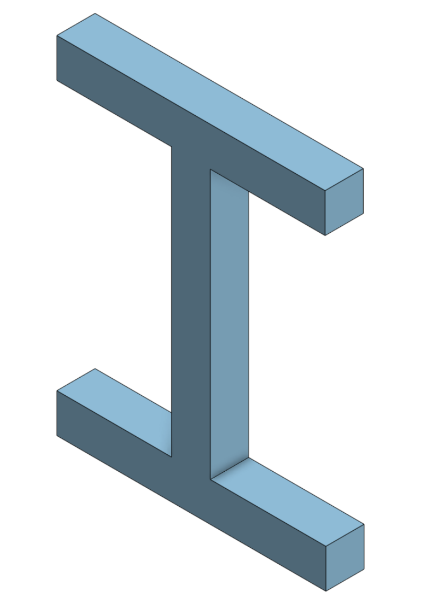
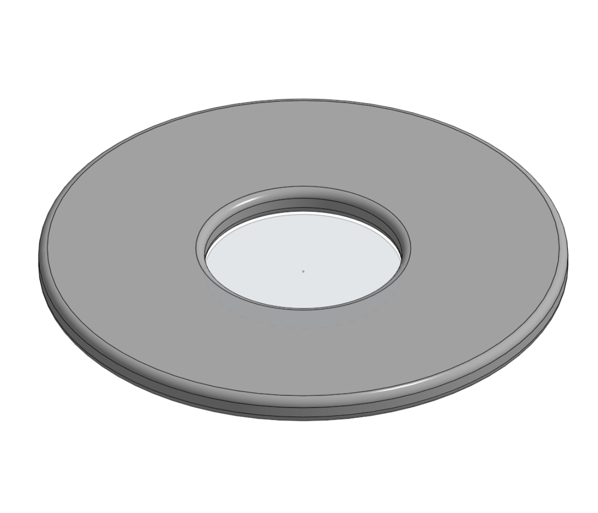
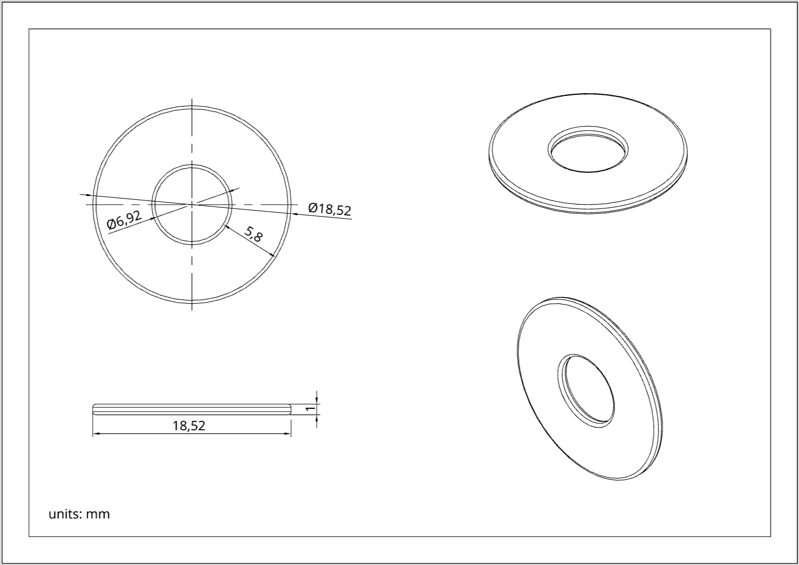
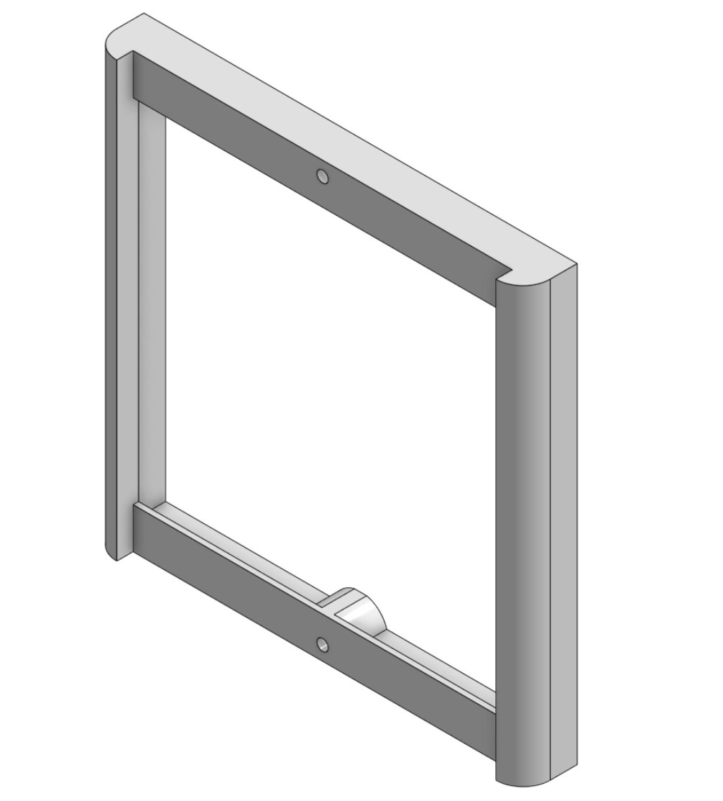
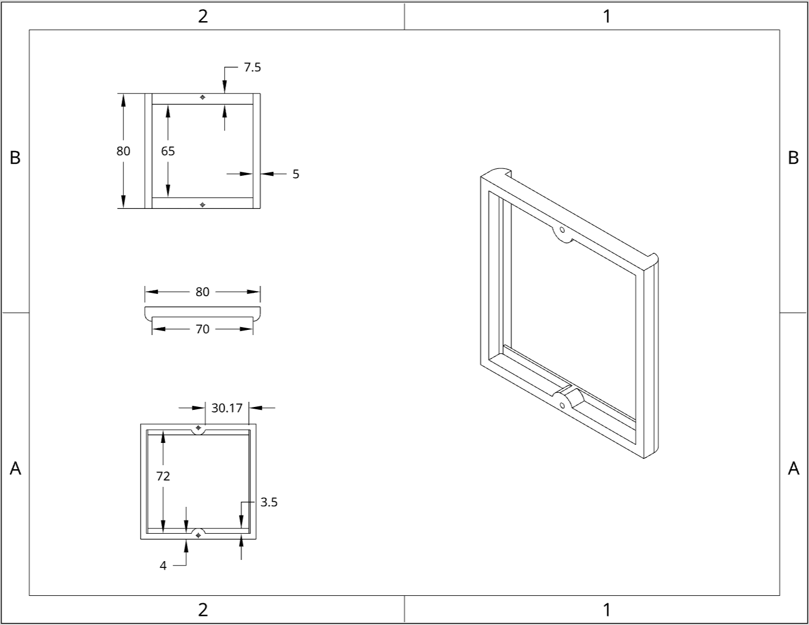
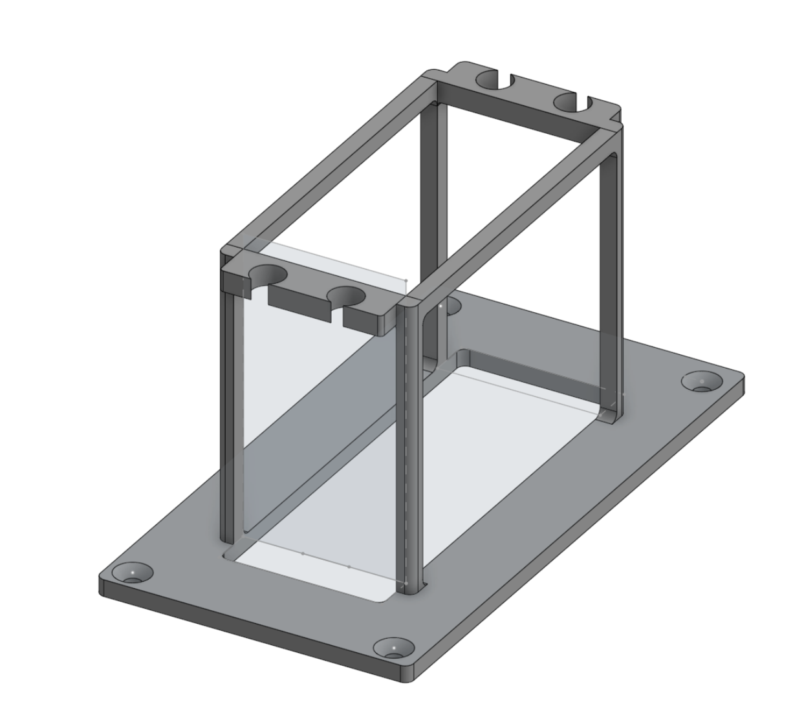
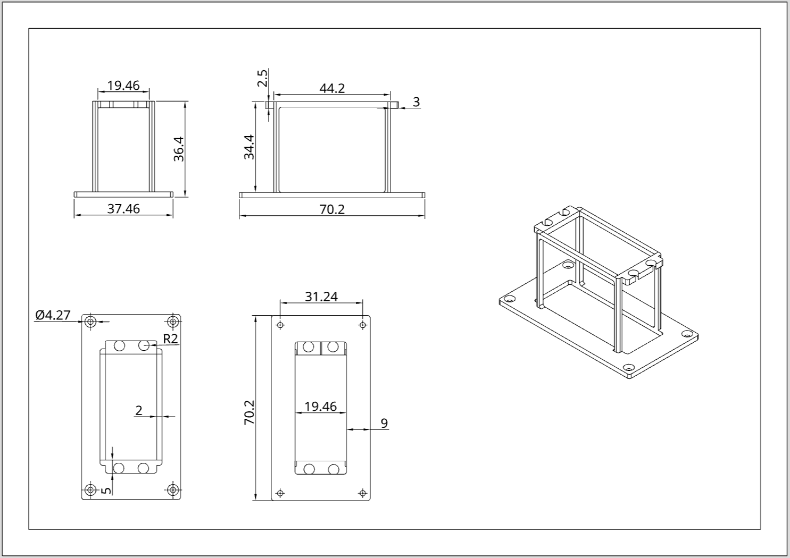

# CAD Designs using Onshape

## About
This repository contains CAD models designed using Onshape.
These designs were created as part of learning basic CAD modeling concepts.

---

## 1. I-Shape Part
This part is an I-shaped component created to practice basic modeling.

[Open in Onshape](https://cad.onshape.com/documents/2898f4710d06091ab4218d7f/w/4be282864a26ca3cdedad17f/e/1e7f97a310880259157e7e51)

---

## 2. Flat Washer
A flat washer with a central hole, used for spacing and load distribution.

**Tools used:**
- Extrude (Add)
- Extrude (Remove)
- Fillet
  

[Open in Onshape](https://cad.onshape.com/documents/1909db1028a6d9c43dda3bf2/w/624d12411f82603f9ab9d875/e/0cdf59d13bbb2ee912210a4e)

---

## 3. Light Switch
A house light switch case designed to hold and protect the light switch.

[Open in Onshape](https://cad.onshape.com/documents/3a9609fe2d22bff50b68c9f6/w/4a65eada7d120e3cdba14990/e/baf4093a745b574460bd6738)

---

## 4. Servo Holder
A holder designed for an MG90S servo motor to keep it fixed in place.

[Open in Onshape](https://cad.onshape.com/documents/9335ca4558bd76b33f10d05b/w/2de47943e0d09dd8ba220a47/e/950f0e86ca705415d0aac0e9)

---

## Author
Huda
